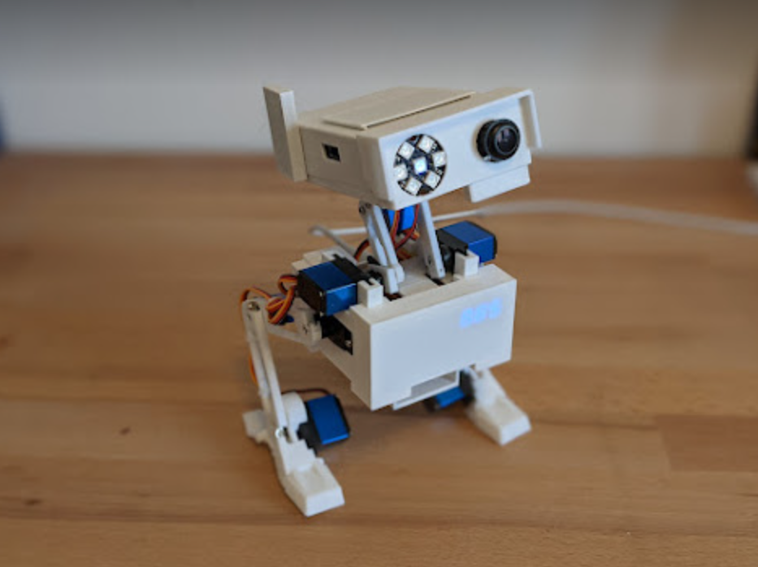

# Bachelorprojekt – Biped Robot

Dette projekt dokumenterer udviklingen af en to-benet robot, der efterligner menneskelig gang ved hjælp af 3D-printede komponenter, Arduino-baseret servostyring og computer vision. En Raspberry Pi anvendes til håndsporing via kamera og sender serielle kommandoer til Arduino for at aktivere gangbevægelse.

## Projektoversigt

Robotten er baseret på det open-source [Modular Biped Robot Project – Archie](https://github.com/makerforgetech/modular-biped/wiki/Archie-Home) udviklet af Dan Makes Things. Den originale model danner grundlag for både det mekaniske design og den overordnede struktur.

Robotten kombinerer mekanisk design, elektronik og software til at opnå grundlæggende bipedal gang. Raspberry Pi bruges til billedbehandling, mens Arduino Nano styrer servoerne.

## Funktionalitet

- 9x MG90S servoer styres af Arduino Nano via bevægelsessekvenser  
- Raspberry Pi 5 anvender MediaPipe og Picamera2 til håndregistrering  
- Seriel USB-kommunikation med isMoving-logik for at undgå overlap  
- Robotten tager ét skridt fremad, når en hånd detekteres inden for 40 cm  

## Hardware og elektronik

- Arduino Nano + specialdesignet PCB til servostyring og strømfordeling  
- Raspberry Pi 5 monteret i hovedet og tilsluttet via GPIO og USB  
- Servoer initialiseres til 90° og testes med visuelle markører  
- USB-C PD-modul leverer 15V til to buck converters (5V og 5.1V)  

## Inkluderede filer

- `Bachelor_Thesis__Building_a_Biped_Robot.pdf` - Fuld rapport med formål, iterativ udviklingsproces og resultater  
- `Source_code/` - Indeholder al projektkode til både Arduino og Raspberry Pi:  
  - `hand_detection.py` – Python-script til håndsporing (MediaPipe + Picamera2)  
  - `robot_movement/` – Arduino-kode med samlet gangsekvens 
  - `1.right_leg_forward/` – første trin  
  - `2.Shift_robot_weight/` – vægtforskydning  
  - `3.left_foot_forward/` – venstre fod frem  
  - `4.return_to_neutral/` – tilbage til neutral  

## Intention

Dette projekt blev afleveret som en del af et bachelorforløb på Syddansk Universitet og deles her for at demonstrere færdigheder inden for mikrokontrollerprogrammering, embedded system-integration, billedgenkendelse med Python, seriel kommunikation og 3D-printet mekanisk design.
